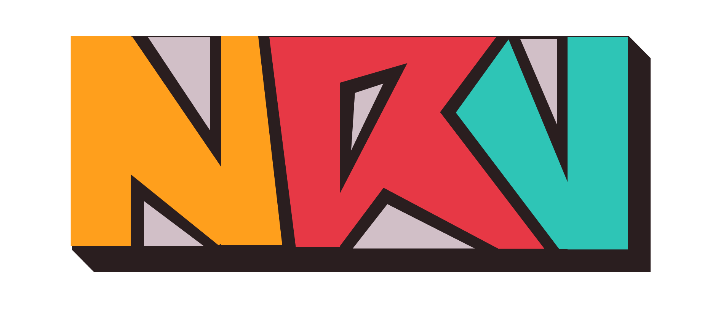

#  Nancy Rock Vibration

[NRV.net](https://lienamettreplustard.fr) est l’application web permettant au grand public de consulter le programme du festival de musique **Nancy Rock Vibration**. L’application permet principalement de consulter et parcourir le programme du festival selon différents critères.

> [!NOTE]
> Membre du groupe
> - HEUERTZ Zacharie
> - KNORST Valentin
> - KORBAN Ryan
> - EYER Nathan
> - BAUDOIN Mathieu

### Note:

Vous trouverez dans le repository et dans nos actions, des méthodes finie, mais dont le temps nous a manqué pour les implémenté graphique sur le site web.
Je pense notamment à l'action permettant de de modfifier un Show existant et toutes ces fonctions associés dans le repository.
Ces fonctions ne sont donc jamais appelées mais nous n'avons pas souhaité les supprimer si cela pourrait prouver que l'amélioration est presque finie.

